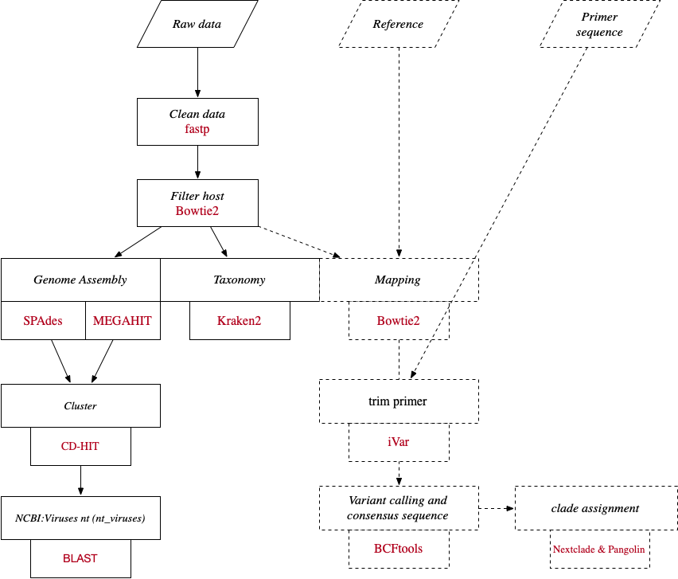

# An integrated data analysis pipeline for viruses

## Step1.Docker Last Update:2025.05

<pre>docker pull fanyucai1/virus
docker tag fanyucai1/virus virus</pre>

## Step2.Prepare Database

**2-1:nextclade**
<pre>python3 core/nextclade_db.py -d /ref/nextclade_db</pre> 

**2-2:virus genome and index**
<pre>python3 core/ref_index.py -o /ref/bowtie2/</pre>

**2-3:ncbi nt virus**

*Download NCBI database using BLAST*:https://ftp.ncbi.nlm.nih.gov/blast/executables/blast+/LATEST/
<pre>
dnf install perl-Archive-Tar
dnf install perl-JSON-PP
</pre>

*View currently available databases for download:*
<pre>perl ncbi-blast-2.16.0+/bin/update_blastdb.pl –showall

    Betacoronavirus
    ITS_RefSeq_Fungi
    28S_fungal_sequences
    18S_fungal_sequences
    ITS_eukaryote_sequences
    LSU_eukaryote_rRNA
    LSU_prokaryote_rRNA
    16S_ribosomal_RNA
    SSU_eukaryote_rRNA
    env_nt
    env_nr
    human_genome
    landmark
    mito
    mouse_genome
    nr
    nt_euk
    nt
    nt_others
    nt_prok
    nt_viruses
    pataa
    patnt
    pdbaa
    pdbnt
    ref_euk_rep_genomes
    ref_prok_rep_genomes
    ref_viroids_rep_genomes
    ref_viruses_rep_genomes
    refseq_select_rna
    refseq_select_prot
    refseq_protein
    refseq_rna
    swissprot
    tsa_nr
    tsa_nt
    taxdb
    core_nt
</pre>

Download **nt_viruses**:
<pre>perl ncbi-blast-2.16.0+/bin/update_blastdb.pl nt_viruses --decompress</pre>

**2-4:kraken2 database:https://benlangmead.github.io/aws-indexes/k2**
<pre>wget https://genome-idx.s3.amazonaws.com/kraken/k2_pluspf_20250402.tar.gz</pre>

**2-5:Download or build host(default:human) genome bowtie2:https://github.com/BenLangmead/bowtie-majref**
<pre>wget https://genome-idx.s3.amazonaws.com/bt/grch38_1kgmaj_snvindels_bt2.zip</pre>

## Step3:run pipeline
<pre>
usage: Virus NGS pipeline.
Email:fanyucai3@gmail.com
 [-h] -p1 PE1 [PE1 ...]
                                                      [-p2 PE2 [PE2 ...]] -p
                                                      PREFIX [PREFIX ...]
                                                      -blastdb BLASTDB -k
                                                      KRAKEN2 [-i IDENTIFY]
                                                      -host HOST -o OUTDIR
                                                      [-bowtie2 BOWTIE2]
                                                      [-bed BED] [-ref REF] -l
                                                      {50,75,100,150,200,250,300}
                                                      [-c {500,1000,1500}]

optional arguments:
  -h, --help            show this help message and exit
  -p1 PE1 [PE1 ...], --pe1 PE1 [PE1 ...]
                        R1 fastq
  -p2 PE2 [PE2 ...], --pe2 PE2 [PE2 ...]
                        R2 fastq
  -p PREFIX [PREFIX ...], --prefix PREFIX [PREFIX ...]
                        prefix of output
  -blastdb BLASTDB, --blastdb BLASTDB
                        blast database name
  -k KRAKEN2, --kraken2 KRAKEN2
                        kraken2 reference index
  -i IDENTIFY, --identify IDENTIFY
  -host HOST, --host HOST
                        directory host bowtie2 index
  -o OUTDIR, --outdir OUTDIR
                        diretory of output
  -bowtie2 BOWTIE2, --bowtie2 BOWTIE2
                        directory reference bowtie2 index
  -bed BED, --bed BED   bed file
  -ref REF, --ref REF   reference fasta reference
  -l {50,75,100,150,200,250,300}, --length {50,75,100,150,200,250,300}
                        read length
  -c {500,1000,1500}, --contig {500,1000,1500}
                        min contig length
</pre>

## relevant external resources

Bacterial and Viral Bioinformatics Resource Center (BV-BRC):https://www.bv-brc.org
 