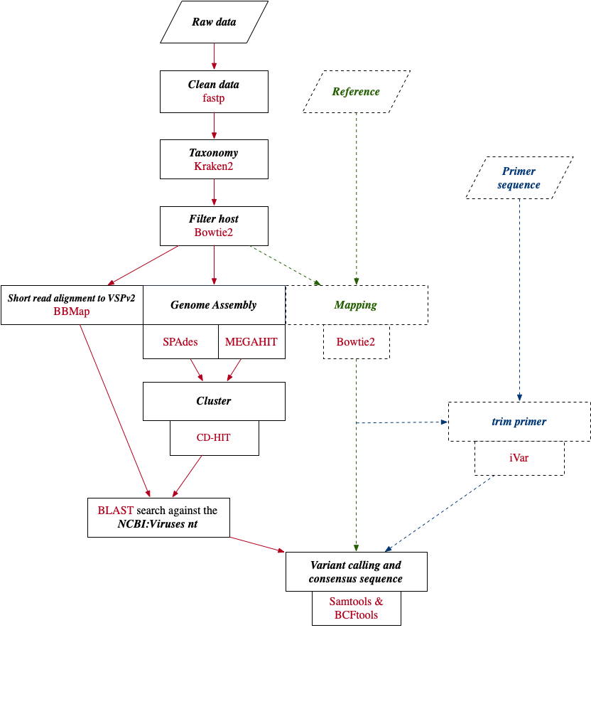

# An integrated data analysis pipeline for viruses

## Step1.Docker

<pre>docker pull fanyucai1/virus
docker tag fanyucai1/virus virus</pre>

## Step2.Prepare Database Last Update:2025.08.07

    mkdir -p /ref/

**2-1:update or downlaod nextclade**
<pre>
rm -rf /ref/nextclade_db/
python3 core/update_nextclade_db.py -d /ref/nextclade_db</pre> 

**2-2:virus genome and index(Optional)**
<pre>
mkdir -p /ref/bowtie2/
python3 core/ref_index.py -o /ref/bowtie2/</pre>

The currently available list of reference genomes for viral species includes:

    Chikungunya_virus
    Dengue_virus_type_1
    Dengue_virus_type_2
    Dengue_virus_type_3
    Dengue_virus_type_4
    H10N4
    H1N1
    H3N2
    H5N1
    H5N6
    H5N8
    H6N1
    H6N2
    H7N9
    H9N2
    HIV-1
    Human_Metapneumovirus
    Human_adenovirus_B1
    Human_adenovirus_F
    Human_adenovirus_type_7
    Influenza_B_viruses_Victoria
    Marburg_Virus
    Measles_virus
    Monkeypox_virus
    Porcine_reproductive_and_respiratory_syndrome_virus_1
    RSV-A
    RSV-B
    SARS-CoV-2
    Yellow_fever_virus
    Zika_virus

**2-3:nt_viruses**

*Download NCBI database using BLAST*:https://ftp.ncbi.nlm.nih.gov/blast/executables/blast+/LATEST/ and nt_viruses
<pre>
dnf install perl-Archive-Tar
dnf install perl-JSON-PP
mkdir -p /ref/nt_viruses
cd /ref/nt_viruses
perl ncbi-blast-2.16.0+/bin/update_blastdb.pl nt_viruses --decompress
</pre>
**If above method fails, you can directly download the corresponding database files from the NCBI BLAST database using wget.** (https://ftp.ncbi.nlm.nih.gov/blast/db/)
<pre>
python3 core/download_NCBI_db.py 22
</pre>
**2-4:vsp database:https://help.idm.illumina.com/dragen-microbial-enrichment-plus/dragen-microbial-enrichment-plus**
Download file:VSPV2_2-7-0_Panel_Summary.xlsx
<pre>
mkdir -p /ref/VSP/
cd /ref/VSP/
python3 core/VSP.py
ncbi-blast-2.14.1+/bin/blastdbcmd -db /ref/nt_viruses/nt_viruses -entry_batch /ref/VSP/accession.list -outfmt "%f" > /ref/VSP/VSP.fasta
ncbi-blast-2.14.1+/bin/makeblastdb -dbtype nucl -in /ref/VSP/VSP.fasta
wget https://ftp.ncbi.nlm.nih.gov/blast/db/taxdb.tar.gz
tar xzvf taxdb.tar.gz
</pre>

**2-5:combine VSP,RVDB and NCBI virus**

    mkdir -p /ref/NCBI_Nucleotide_Completeness
    cd /ref/NCBI_Nucleotide_Completeness

Download NCBI virus Nucleotide (Completeness) and Accession without version:**sequences.acc**:https://www.ncbi.nlm.nih.gov/labs/virus/vssi/#/virus?SeqType_s=Nucleotide&Completeness_s=complete

Download Current Release **Reference Viral DataBase(RVDB)**:https://rvdb.dbi.udel.edu/previous-release
    
    wget https://rvdb.dbi.udel.edu/download/U-RVDBv30.0.fasta.gz
    gunzip U-RVDBv30.0.fasta.gz
    grep ">" U-RVDBv30.0.fasta|awk -F"|" {print $3} |awk -F"." {print $1}>RVDB_accession.list
    sort RVDB_accession.list sequences.acc | uniq -d | cat VSP_accession.list - | sort -u > final.txt
    ncbi-blast-2.14.1+/bin/blastdbcmd -db /ref/nt_viruses/nt_viruses -out virus.fasta -entry_batch final.txt -outfmt "%f"
    grep ">" virus.fasta|sort -u|awk -F" " {print $1}|awk -F">" {print $2} >acc.id
    rm -rf virus.fasta final.txt
    ncbi-blast-2.14.1+/bin/blastdbcmd -db /ref/nt_viruses/nt_viruses -out virus_completeness_unique.fasta -entry_batch acc.id -outfmt "%f"
    ncbi-blast-2.14.1+/bin/makeblastdb -in virus_completeness_unique.fasta -dbtype nucl

**2-5:kraken2 database:https://benlangmead.github.io/aws-indexes/k2**
<pre>
mkdir -p /ref/kraken/
cd /ref/kraken/
wget https://genome-idx.s3.amazonaws.com/kraken/k2_pluspf_20250402.tar.gz
tar xvzf k2_pluspf_20250402.tar.gz
</pre>

**2-5:Download or build host(default:human) genome bowtie2:https://github.com/BenLangmead/bowtie-majref**
<pre>
mkdir -p /ref/host/human/
cd /ref/host/human/
wget https://genome-idx.s3.amazonaws.com/bt/grch38_1kgmaj_snvindels_bt2.zip
unzip grch38_1kgmaj_snvindels_bt2.zip
</pre>

## Step3:run pipeline
<pre>
usage: Virus NGS pipeline.
Email:fanyucai3@gmail.com
 [-h] -p1 PE1 [PE1 ...] [-p2 PE2 [PE2 ...]] -p PREFIX [PREFIX ...] -o OUTDIR -c CONFIG -l {50,75,100,150,200,250,300} [-e BED] [-r REF] [-b BOWTIE2]

options:
  -h, --help            show this help message and exit
  -p1 PE1 [PE1 ...], --pe1 PE1 [PE1 ...]
                        R1 fastq
  -p2 PE2 [PE2 ...], --pe2 PE2 [PE2 ...]
                        R2 fastq
  -p PREFIX [PREFIX ...], --prefix PREFIX [PREFIX ...]
                        prefix of output
  -o OUTDIR, --outdir OUTDIR
                        diretory of output
  -c CONFIG, --config CONFIG
                        config file
  -l {50,75,100,150,200,250,300}, --length {50,75,100,150,200,250,300}
                        read length

Reference/Bowtie2 Index Options:
  -e BED, --bed BED     bed file
  -r REF, --ref REF     ref fasta
  -b BOWTIE2, --bowtie2 BOWTIE2
                        directory contains reference bowtie2 index
</pre>

Command-line example: 

    python3 pipeline.py -p1 sampleID_R1.fastq.gz -p2 sampleID_R2.fastq.gz -p sampleID -o outdir/ -l 150 -c config.ini
    
    python3 pipeline.py -p1 sampleID_R1.fastq.gz -p2 sampleID_R2.fastq.gz -p sampleID -o outdir/ -l 150 -c config.ini -r ref.fasta -b /ref/bowtie2/Chikungunya_virus/ -e primer.bed
    
    python3 pipeline.py -p1 sampleID_R1.fastq.gz -p2 sampleID_R2.fastq.gz -p sampleID -o outdir/ -l 150 -c config.ini -r ref.fasta -b /ref/bowtie2/Chikungunya_virus/

**Relevant external resources:**

Bacterial and Viral Bioinformatics Resource Center (BV-BRC):https://www.bv-brc.org