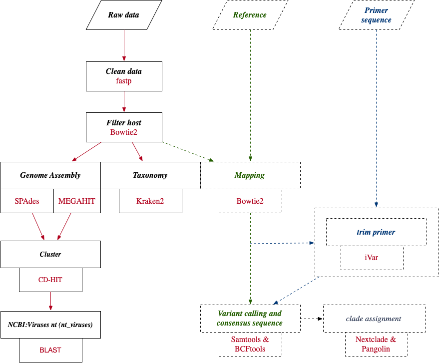

## An integrated data analysis pipeline for viruses(amplicon-based)

### 1.Docker Last Update:2025.05

<pre>docker pull fanyucai1/virus</pre>

### 2.Database

**2-1:nextclade**
<pre>python3 core/download_nextclade_db.py -d /ref/nextclade_db</pre> 

**2-2:virus genome and index**
<pre>python3 core/build_database.py -o ref/bowtie2/</pre>

**2-3:ncbi nt virus**

*Download NCBI database using BLAST*:https://ftp.ncbi.nlm.nih.gov/blast/executables/blast+/LATEST/
<pre>
dnf install perl-Archive-Tar
dnf install perl-JSON-PP
</pre>

*View currently available databases for download:*
<pre>perl ncbi-blast-2.16.0+/bin/update_blastdb.pl –showall

    Betacoronavirus
    ITS_RefSeq_Fungi
    28S_fungal_sequences
    18S_fungal_sequences
    ITS_eukaryote_sequences
    LSU_eukaryote_rRNA
    LSU_prokaryote_rRNA
    16S_ribosomal_RNA
    SSU_eukaryote_rRNA
    env_nt
    env_nr
    human_genome
    landmark
    mito
    mouse_genome
    nr
    nt_euk
    nt
    nt_others
    nt_prok
    nt_viruses
    pataa
    patnt
    pdbaa
    pdbnt
    ref_euk_rep_genomes
    ref_prok_rep_genomes
    ref_viroids_rep_genomes
    ref_viruses_rep_genomes
    refseq_select_rna
    refseq_select_prot
    refseq_protein
    refseq_rna
    swissprot
    tsa_nr
    tsa_nt
    taxdb
    core_nt
</pre>

Download **nt_viruses**:
<pre>perl ncbi-blast-2.16.0+/bin/update_blastdb.pl nt_viruses --decompress</pre>

